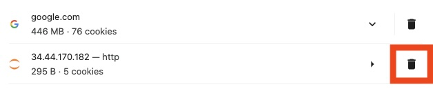

# RAG on GKE

This is a sample to deploy a Retrieval Augmented Generation (RAG) application on GKE. 

### RAG on GKE Architecture
1. A GKE service endpoint serving `gemma-2b-it`.
2. [Cloud SQL `pgvector` instance](https://github.com/pgvector/pgvector) with vector embeddings generated from an input dataset.
3. A [Ray](https://docs.ray.io/en/latest/ray-overview/getting-started.html) cluster running on GKE that runs jobs to generate embeddings and populate the vector DB.
5. A [Jupyter](https://docs.jupyter.org/en/latest/) notebook running on GKE that reads the dataset using GCS fuse driver integrations and runs a Ray job to populate the vector DB.
3. A front end chat interface running on GKE that prompts the inference server with context from the vector DB.

This tutorial walks you through installing the RAG infrastructure in a GCP project, generating vector embeddings for a sample [Kaggle Netflix shows](https://www.kaggle.com/datasets/shivamb/netflix-shows) dataset and prompting the LLM with context.

# Prerequisites

### Install tooling (required)

Install the following on your computer:
* [Kubectl](https://kubernetes.io/docs/tasks/tools/#kubectl)
* [Terraform](https://developer.hashicorp.com/terraform/tutorials/aws-get-started/install-cli)
* [Helm](https://helm.sh/docs/intro/install/)
* [Gcloud](https://cloud.google.com/sdk/docs/install)

### Set up gcloud
Run the following in your computer:

```
export PROJECT_ID=<YOUR_PROJECT_ID>
gcloud auth application-default login
gcloud config set project $PROJECT_ID
gcloud auth application-default set-quota-project $PROJECT_ID
``` 

# Installation

This section sets up the RAG infrastructure in your GCP project using Terraform.

**NOTE:** Terraform keeps state metadata in a local file called `terraform.tfstate`. Deleting the file may cause some resources to not be cleaned up correctly even if you delete the cluster. We suggest using `terraform destroy` before reapplying/reinstalling.

1. `cd ai-on-gke/applications/rag`

2. Edit `workloads.tfvars` to set your project ID and optionally the location and cluster name. 

3. Generate a [Hugging Face User Access Token](https://huggingface.co/settings/tokens) and set the environment variable: `export TF_VAR_hf_token=YOUR_ACCESS_TOKEN`
   
4. Go to the [model card](https://huggingface.co/google/gemma-2b-it) in Hugging Face and click "Agree and access repository"

5. Run `terraform init`

6. Run `terraform apply --var-file workloads.tfvars --auto-approve`. Note: if you're running this on Cloud Shell, you may be prompted to authorize Cloud Shell to access your credentials. If that happens, select **Authorize.**


# Upload some data
First, upload some PDFs to your [Cloud Storage bucket](https://console.cloud.google.com/storage/browser). The bucket should have the same name as your project ID.

Here's a suggestion:
* [Alphabet's 10k financial report](https://abc.xyz/assets/43/44/675b83d7455885c4615d848d52a4/goog-10-k-2023.pdf)

To upload it, run:
```
curl https://abc.xyz/assets/43/44/675b83d7455885c4615d848d52a4/goog-10-k-2023.pdf -o goog-10k-2023.pdf && gsutil cp goog-10k-2023.pdf gs://$PROJECT_ID/
```

# Run the Notebook to generate vector embeddings for the dataset

We will use a Jupyter notebook to run a Ray job that generates the embeddings & populates them into the `pgvector` instance created in the previous step.

Set your the namespace, cluster name and location from `workloads.tfvars`):

```
export NAMESPACE=ai-on-gke
export CLUSTER_LOCATION=us-central1
export CLUSTER_NAME=ai-dev-cluster
```

Note: confirm that these values match what's in `workloads.tfvars`.

Connect to the GKE cluster:

```
gcloud container clusters get-credentials ${CLUSTER_NAME} --location=${CLUSTER_LOCATION}
```

1. Connect and login to JupyterHub:
    - Find the external IP address of the JupyterHub proxy service: `kubectl get services proxy-public -n $NAMESPACE`
    - In a new browser tab, type in the URL the IP address you see under `EXTERNAL-IP`. Do not use HTTPS.
    - Login with these credentials:
       * username: admin
       * password: use `terraform output jupyterhub_password` to fetch the password value

**Note:** If you see the error **"XSRF cookie does not match POST argument"**, clear up cookies and try again. To do so in Chrome, go to [chrome://settings/cookies](chrome://settings/cookies), click on **See all site data and permissions**, find the URL corresponding to the external IP address of your Jupyter service, and delete the related cookies as shown in the following screenshot:



2. Load the notebook:
   - Once logged in to JupyterHub, if asked, choose the `CPU` preset with `Default` storage.
   - Click [File] -> [Open From URL] and paste: `https://raw.githubusercontent.com/vmehmeri/ai-on-gke/main/applications/rag/example_notebooks/rag-ray-sql-interactive.ipynb`

3. Set the `bucket_name` variable to match your `project_id`:
   
   ``` bucket_name = YOUR_PROJECT_ID ``` 

4. Generate vector embeddings: Run all the cells in the notebook to generate vector embeddings for documents and store them in the `pgvector` CloudSQL instance via a Ray job.
    * When the last cell says the job has succeeded, the vector embeddings have been generated and we can launch the frontend chat interface. Note that running the job can take up to 10 minutes.
    * Ray may take several minutes to create the runtime environment. During this time, the job will appear to be missing (e.g. `Status message: PENDING`).
    * (Optional) Connect to the Ray dashboard to check the job status or logs:
          - `kubectl port-forward -n ${NAMESPACE} service/ray-cluster-kuberay-head-svc 8265:8265`
          - Go to `localhost:8265` in a browser
  
Note: if you see Unschedulable Pods issue when running the notebook cell that runs Ray workers, try stopping and re-running the code cell. If it still doesn't work, it could be a stockout or quota issue related to GPUs in the region.
        
# Launch the frontend chat interface

1. Connect to the frontend:
     - Port forward to the frontend service: `kubectl port-forward service/rag-frontend -n ${NAMESPACE} 8080:8080 &`
     - Go to `localhost:8080` in a browser. If you're running this on Cloud Shell, click on the Web Preview icon (top-right corner of the Shell pane) and then **Preview on port 8080**.
   
2. Prompt the LLM
    * Start chatting! This will fetch context related to your prompt from the vector embeddings in the `pgvector` CloudSQL instance, augment the original prompt with the context & query the inference model (`gemma-2b-it`) with the augmented prompt.
    * If you're using the sample document provided (Alphabet's 10k financial report - 2023), here are some prompts to try:
      * What do Paid clicks represent?
      * When did Google's AI journey begin?
      * How is Alphabet leveraging Gemini?


# Cleanup

1. Run `terraform destroy --var-file="workloads.tfvars"`
    - Network deletion issue: `terraform destroy` fails to delete the network due to a known issue in the GCP provider. For now, the workaround is to manually delete it.

